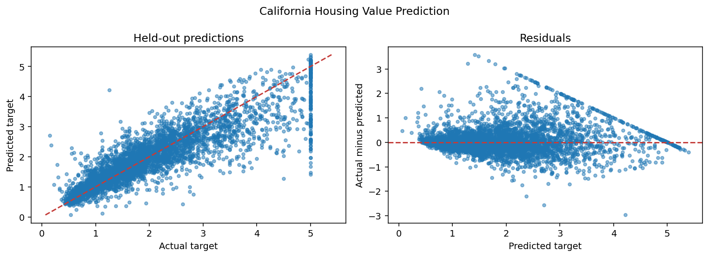

# California Housing Value Prediction

Estimate median district house value from census-derived attributes.

| Item | Specification |
| --- | --- |
| Task | Regression |
| Estimator | Support vector regression |
| Target | `MedHouseVal` |
| Validation | 80/20 holdout, seed 42; 3-fold shuffled training-only cross-validation |
| Baseline | Training-target mean |

## Run

From the repository root after the [environment setup](../../README.md#quick-start):

```bash
python -m ml_portfolio download-housing
python -m ml_portfolio run california-housing
```

Explore [the notebook](notebooks/analysis.ipynb) for training-only EDA, validation, diagnostics, and example predictions. The notebook and CLI use the same tested implementation in `src/ml_portfolio`.

## Evaluation and interpretation

Select hyperparameters using negative RMSE on training folds; report MAE, RMSE, and R² on the held-out test set, with residual and actual-versus-predicted plots.

Preprocessing is fitted inside each cross-validation fold. Exact repeated predictor rows are deduplicated before splitting; conflicting labels for identical predictors are excluded and counted. IDs are excluded. All metrics, cleaning counts, dataset fingerprints, versions, and selected parameters are saved to `reports/california-housing/metrics.json`.

See [measured results](../../reports/RESULTS.md). A score on one holdout is evidence about this dataset, not a guarantee on new populations.

## Reproduced result

On 4,128 held-out records, **rmse = 0.5668**, compared with **1.1449** for the dummy baseline.

RMSE is about 0.567 in $100,000 units (roughly $56,700). The target cap is visible in the diagnostics, and random geographic mixing limits what this result says about new locations.



## Limitations

Target units are $100,000 and values are capped. Random holdout is not a spatial or temporal generalization test. Historical census data do not describe current prices.

## Interview discussion

- Explain why this model suits the problem and compare it with the dummy baseline.
- Walk through preprocessing and show how the training pipeline prevents leakage.
- Use the diagnostic plot to discuss errors and their practical consequences.
- Propose an independent validation set and justify the next experiment before deployment.

[Back to portfolio](../../README.md)
