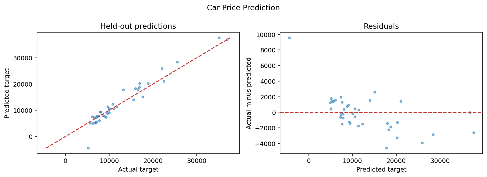

# Car Price Prediction

Estimate vehicle prices from specifications.

| Item | Specification |
| --- | --- |
| Task | Regression |
| Estimator | Linear regression |
| Target | `price` |
| Validation | 80/20 holdout, seed 42; 3-fold shuffled training-only cross-validation |
| Baseline | Training-target mean |

## Run

From the repository root after the [environment setup](../../README.md#quick-start):

```bash
python -m ml_portfolio list
python -m ml_portfolio run car-price
```

Explore [the notebook](notebooks/analysis.ipynb) for training-only EDA, validation, diagnostics, and example predictions. The notebook and CLI use the same tested implementation in `src/ml_portfolio`.

## Evaluation and interpretation

Select hyperparameters using negative RMSE on training folds; report MAE, RMSE, and R² on the held-out test set, with residual and actual-versus-predicted plots.

Preprocessing is fitted inside each cross-validation fold. Exact repeated predictor rows are deduplicated before splitting; conflicting labels for identical predictors are excluded and counted. IDs are excluded. All metrics, cleaning counts, dataset fingerprints, versions, and selected parameters are saved to `reports/car-price/metrics.json`.

See [measured results](../../reports/RESULTS.md). A score on one holdout is evidence about this dataset, not a guarantee on new populations.

## Reproduced result

On 38 held-out records, **rmse = 2339.1652**, compared with **7530.5271** for the dummy baseline.

Only 38 records form the test set, and 16 rows with identical specifications but different prices are excluded by the documented conflict policy. CV RMSE is higher than holdout RMSE; the small holdout should not be treated as a stable market estimate.



## Limitations

Small historical sample; currency and collection period are not verified. Predictions do not represent current market quotes.

## Interview discussion

- Explain why this model suits the problem and compare it with the dummy baseline.
- Walk through preprocessing and show how the training pipeline prevents leakage.
- Use the diagnostic plot to discuss errors and their practical consequences.
- Propose an independent validation set and justify the next experiment before deployment.

[Back to portfolio](../../README.md)
