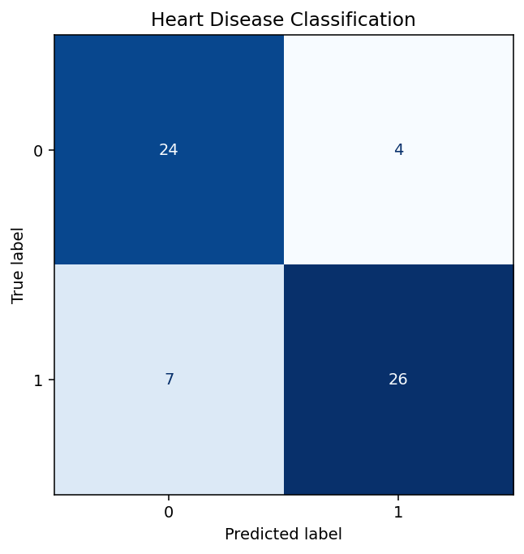

# Heart Disease Classification

Classify the recorded binary heart-disease target.

| Item | Specification |
| --- | --- |
| Task | Classification |
| Estimator | k-nearest neighbors |
| Target | `target` |
| Validation | 80/20 holdout, seed 42; 3-fold shuffled training-only cross-validation |
| Baseline | Most-frequent class |

## Run

From the repository root after the [environment setup](../../README.md#quick-start):

```bash
python -m ml_portfolio list
python -m ml_portfolio run heart-disease
```

Explore [the notebook](notebooks/analysis.ipynb) for training-only EDA, validation, diagnostics, and example predictions. The notebook and CLI use the same tested implementation in `src/ml_portfolio`.

## Evaluation and interpretation

Select hyperparameters using macro F1 on training folds; report accuracy, macro F1, per-class precision/recall/F1, and a confusion matrix on the held-out test set. Binary projects also report positive-class precision, recall, F1, and ROC AUC.

Preprocessing is fitted inside each cross-validation fold. Exact repeated predictor rows are deduplicated before splitting; conflicting labels for identical predictors are excluded and counted. IDs are excluded. All metrics, cleaning counts, dataset fingerprints, versions, and selected parameters are saved to `reports/heart-disease/metrics.json`.

See [measured results](../../reports/RESULTS.md). A score on one holdout is evidence about this dataset, not a guarantee on new populations.

## Reproduced result

On 61 held-out records, **macro_f1 = 0.8195**, compared with **0.3511** for the dummy baseline.

Deduplication removes 723 repeated rows, leaving 302 usable records and a 61-record holdout. Positive-class recall is about 0.788: missed positive cases remain a material limitation.



## Limitations

Repeated records are removed before splitting. Patient identifiers and external validation are unavailable; this is not a diagnostic tool.

## Interview discussion

- Explain why this model suits the problem and compare it with the dummy baseline.
- Walk through preprocessing and show how the training pipeline prevents leakage.
- Use the diagnostic plot to discuss errors and their practical consequences.
- Propose an independent validation set and justify the next experiment before deployment.

[Back to portfolio](../../README.md)
