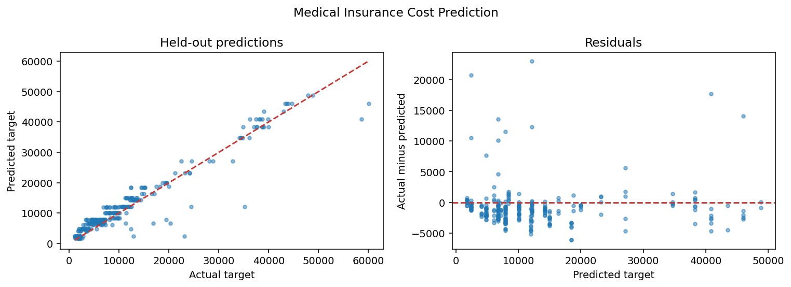

# Medical Insurance Cost Prediction

Estimate recorded insurance charges from demographic and lifestyle attributes.

| Item | Specification |
| --- | --- |
| Task | Regression |
| Estimator | Decision tree |
| Target | `charges` |
| Validation | 80/20 holdout, seed 42; 3-fold shuffled training-only cross-validation |
| Baseline | Training-target mean |

## Run

From the repository root after the [environment setup](../../README.md#quick-start):

```bash
python -m ml_portfolio list
python -m ml_portfolio run insurance-cost
```

Explore [the notebook](notebooks/analysis.ipynb) for training-only EDA, validation, diagnostics, and example predictions. The notebook and CLI use the same tested implementation in `src/ml_portfolio`.

## Evaluation and interpretation

Select hyperparameters using negative RMSE on training folds; report MAE, RMSE, and R² on the held-out test set, with residual and actual-versus-predicted plots.

Preprocessing is fitted inside each cross-validation fold. Exact repeated predictor rows are deduplicated before splitting; conflicting labels for identical predictors are excluded and counted. IDs are excluded. All metrics, cleaning counts, dataset fingerprints, versions, and selected parameters are saved to `reports/insurance-cost/metrics.json`.

See [measured results](../../reports/RESULTS.md). A score on one holdout is evidence about this dataset, not a guarantee on new populations.

## Reproduced result

On 267 held-out records, **rmse = 3529.7627**, compared with **11853.2428** for the dummy baseline.

The regularized tree captures nonlinear patterns, but large errors remain. Inspect residuals rather than interpreting aggregate R² as accuracy for individual insurance quotes.



## Limitations

Charges are observational and highly skewed. This is not an underwriting or individual pricing tool.

## Interview discussion

- Explain why this model suits the problem and compare it with the dummy baseline.
- Walk through preprocessing and show how the training pipeline prevents leakage.
- Use the diagnostic plot to discuss errors and their practical consequences.
- Propose an independent validation set and justify the next experiment before deployment.

[Back to portfolio](../../README.md)
