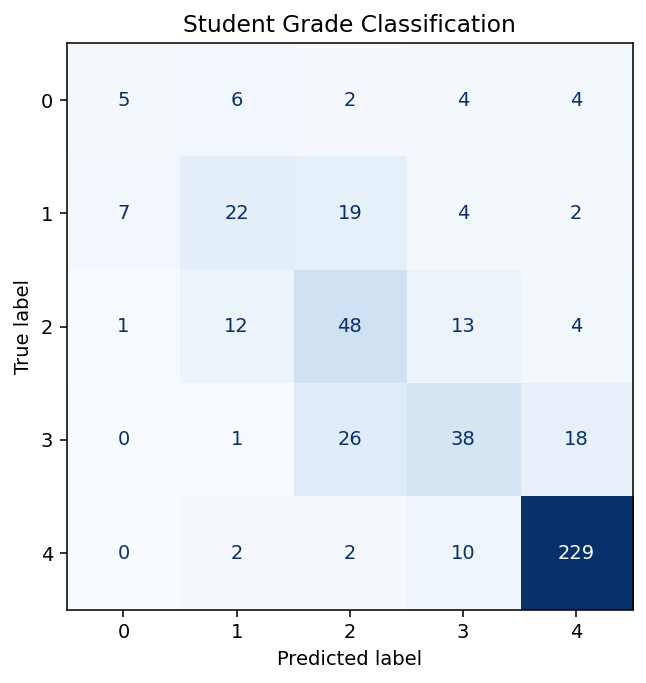

# Student Grade Classification

Classify five recorded grade categories using non-GPA attributes.

| Item | Specification |
| --- | --- |
| Task | Classification |
| Estimator | Logistic regression |
| Target | `GradeClass` |
| Validation | 80/20 holdout, seed 42; 3-fold shuffled training-only cross-validation |
| Baseline | Most-frequent class |

## Run

From the repository root after the [environment setup](../../README.md#quick-start):

```bash
python -m ml_portfolio list
python -m ml_portfolio run student-grades
```

Explore [the notebook](notebooks/analysis.ipynb) for training-only EDA, validation, diagnostics, and example predictions. The notebook and CLI use the same tested implementation in `src/ml_portfolio`.

## Evaluation and interpretation

Select hyperparameters using macro F1 on training folds; report accuracy, macro F1, per-class precision/recall/F1, and a confusion matrix on the held-out test set. Binary projects also report positive-class precision, recall, F1, and ROC AUC.

Preprocessing is fitted inside each cross-validation fold. Exact repeated predictor rows are deduplicated before splitting; conflicting labels for identical predictors are excluded and counted. IDs are excluded. All metrics, cleaning counts, dataset fingerprints, versions, and selected parameters are saved to `reports/student-grades/metrics.json`.

See [measured results](../../reports/RESULTS.md). A score on one holdout is evidence about this dataset, not a guarantee on new populations.

## Reproduced result

On 479 held-out records, **macro_f1 = 0.5425**, compared with **0.1346** for the dummy baseline.

Without GPA, macro F1 is about 0.542 despite accuracy around 0.714. Inspect each grade class; overall accuracy obscures unequal performance. This honest result is a stronger discussion point than predicting a grade directly from GPA.



## Limitations

GPA is excluded as a direct outcome proxy. This is multiclass grade classification, not pass/fail prediction. Data provenance and timing of predictors need verification.

## Interview discussion

- Explain why this model suits the problem and compare it with the dummy baseline.
- Walk through preprocessing and show how the training pipeline prevents leakage.
- Use the diagnostic plot to discuss errors and their practical consequences.
- Propose an independent validation set and justify the next experiment before deployment.

[Back to portfolio](../../README.md)
